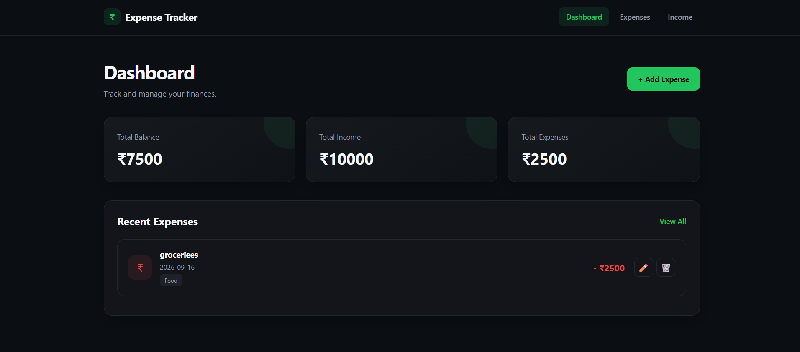
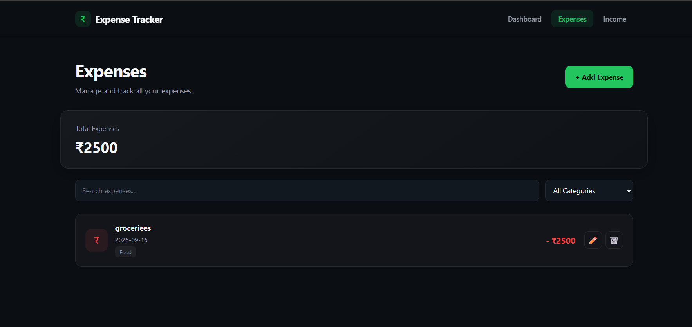
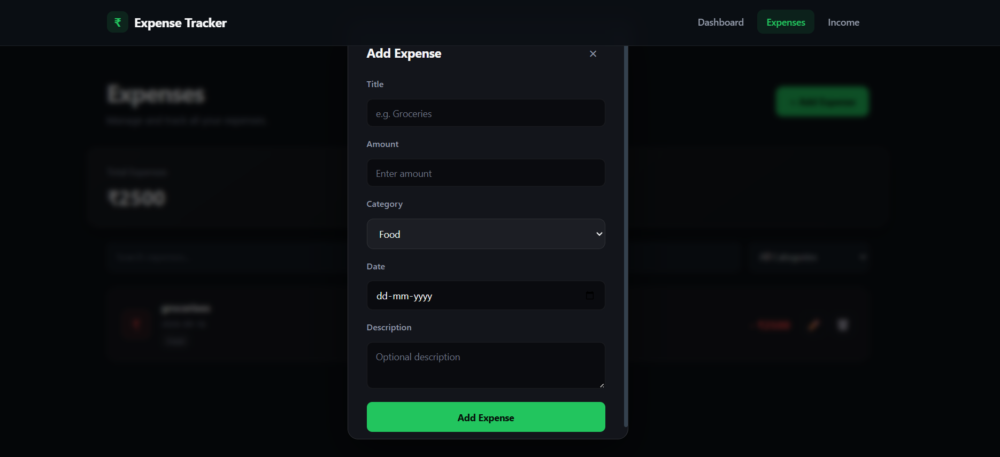
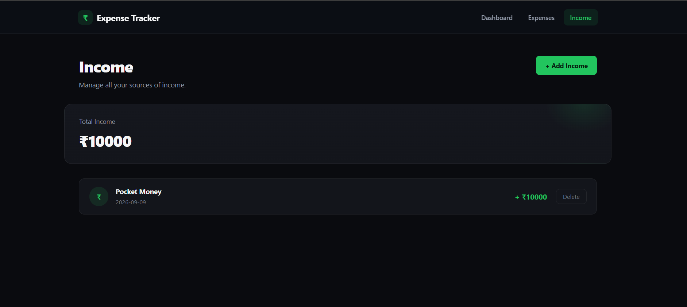
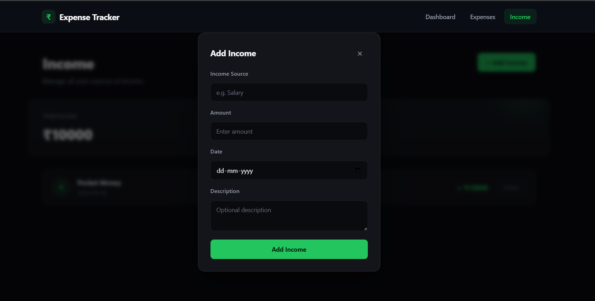

# 💰 Expense Tracker

Expense Tracker is a full-stack web application that I built to keep track of income and expenses in one place.

The main goal of this project was to build something practical while getting hands-on experience with React, Node.js, Express and connecting a frontend with a backend through APIs.

## ✨ What can you do with it?

- Add new expenses
- Edit existing expenses
- Delete expenses
- Add income
- Delete income
- Search for expenses
- Filter expenses by category
- View total income
- View total expenses
- View total balance
- See recent expenses directly from the dashboard

The dashboard automatically calculates the current balance based on the income and expenses entered.

## 🖥️ Screenshots

### Dashboard

### Expenses

### Income

## 🛠️ Technologies Used

### Frontend
- React.js
- Vite
- React Router
- Axios
- CSS

### Backend
- Node.js
- Express.js
- REST APIs

## 📁 Project Structure

Expense-Tracker/
│
├── BACKEND/
│   ├── src/
│   │   ├── controllers/
│   │   ├── routes/
│   │   └── data/
│   │
│   ├── server.js
│   └── package.json
│
|___FRONTEND/
|   ├── frontend/
│   ├── src/
│   │   ├── components/
│   │   ├── pages/
│   │   ├── api/
│   │   └── styles/
|   |   |__App.jsx
|   |   |__index.css
|   |   |__main.jsx
│   │
│   └── package.json
│
└── README.md